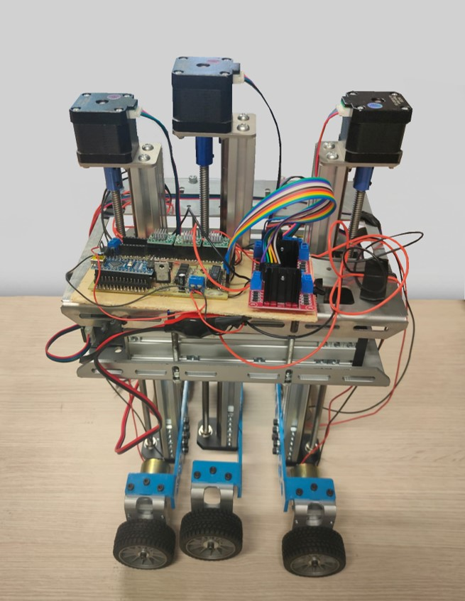

 

  <h1 align="center">Progetto Leonardo</h1>

  

    An IEEE Student Branch Project
     
     
  

<!--    
-->
## Table Of Contents

* [About the Project](#about-the-project)
* [Built With](#built-with)
* [Roadmap](#roadmap)
* [Authors](#authors)

## About The Project

Project with the aim of building a robot that is able to move and climb stairs.

## Built With

Raspberry and Arduino

## Roadmap

See the [open issues](https://github.com/TTT357C/Progetto_Leonardo/issues) for a list of proposed features (and known issues).  
See also our trello [Trello](https://trello.com/b/dbFiTYEp/progetto-leonardo-ieee-student-branch-brescia)

## Authors

* **Thomas Causetti** - *Engineering Student and Member of IEEE* - [Thomas Causetti](https://github.com/TTT357C/) - *Programmer and Designer*
* **Mirko Rossi** - *Engineering Student and Member of IEEE* - [Mirko Rossi](https://github.com/Zphyr19) - *Programmer*
* **Abdel** - *Engineering Student and Member of IEEE* - [Abdel](https://github.com/99Abdel) - *Programmer*
* **Stefano Molari** - *Engineering Student and Member of IEEE* - [Stefano Molari](https://github.com/steMola) - *Circuit Designer*
